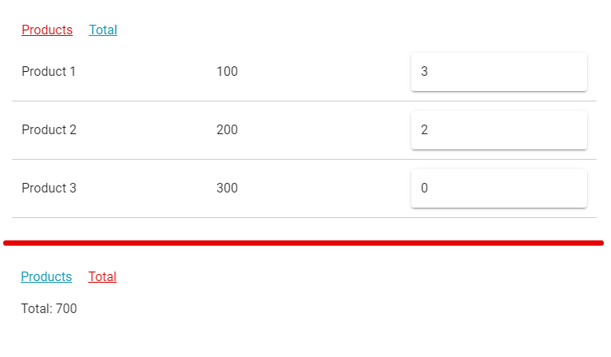

# vuetify test

## Project setup
```
npm install
```

### Compiles and hot-reloads for development
```
npm run serve
```

### Compiles and minifies for production
```
npm run build
```

### Lints and fixes files
```
npm run lint
```

### Requirements
Есть одностраничное приложение на Vuetify. Нужно добавить в него 2 страницы:

1. Products
   Содержит таблицу из 3 колонок:
- продукт
- цена
- количество продуктов (поле ввода)

2. Total
   Содержит общую стоимость всех продуктов (цена * количество).

При переключении страниц с Products на Total и наоборот введенные данные должны сохраняться. Для этих целей нужно использовать VueRouter и Vuex.

- - - - -

Цвет ссылок "Products" и "Total" должен использовать цвет "primary" из Vuetify и прописать его нужно в css-стилях в шаблоне, а не в html-теге.

Цвет активной ссылки нужно задать в файле переменных и затем использовать их в css-стилях в шаблоне:
/src/assets/styles/variables.scss

Больше ничего оформлять не нужно.

- - - - -

Сам проект собран, все зависимости уже добавлены. Нужно только добавить новые страницы.

Данные для продуктов уже добавлены в файле Vuex Store:
/src/store/state.js

- - - - - - - - - - - - - - - - - - - -

Отдельным, но необязательным заданием нужно заставить работать этот проект в IE 11. Специально ничего не ломалось. Проект сейчас в таком виде, в каком его предоставляет Vue CLI.

Это задание не обязательное, но служит дополнительным бонусом в результатах.

- - - - -

Выглядеть это должно приблизительно так:

